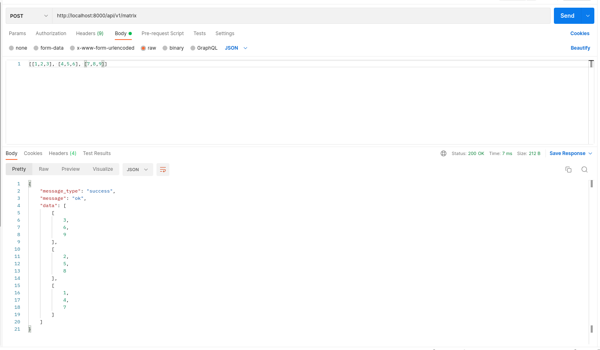

# API MATRIX - RETO QDS

### Test Endpoint

- matrix
```
// [POST] http://137.184.238.39/api/v1/matrix/api/v1/matrix
// Headers Content-Type: application/json
// body example
input:
    {
        [[1,2], [3,4]]
    }
output:
    {
        "message_type": "success",
        "message": "ok",
        "data": [
            [
                2,
                4
            ],
            [
                1,
                3
            ]
        ]
    }
```

### EXAMPLE (img)



### Run dev
```
go run cmd/main.go
```

### Build (binary)
```
// linux
go build -o bin/bin cmd/main.go

// win
go build -o bin/bin.exe cmd/main.go
```